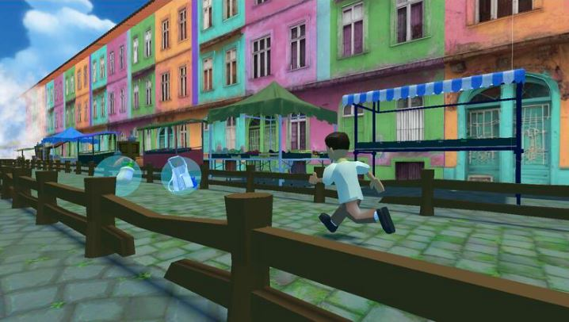
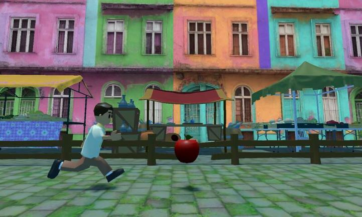

# 📱 Kusina Krusada!
### An Educational Mobile Game for the Food Microbiology Academy

Kusina Krusada is an educational mobile game developed by a team of five as part of a final university project in collaboration with the Food Microbiology Academy, an organisation based in both Australia and the Philippines. The game teaches young players about food safety, hygiene, and microbiology through fast‑paced, engaging gameplay.

Designed as an endless‑runner, Kusina Krusada is built for both **iOS and Android**, making it accessible to a wide audience.

  

---

## 🎮 Gameplay Overview

Players take on the role of the Handler Hero, running through a map inspired by a Filipino street‑food market while dodging obstacles and collecting power‑ups. Every round feels fresh and unpredictable thanks to procedural generation.

The objective is simple: **survive as long as possible and compete for the highest score**.

Along the way, players must avoid harmful microbes and kitchen hazards. If the player collides with a microbe, the game pauses and presents a food health and safety quiz question. Answering correctly reinforces learning and allows the player to continue, turning mistakes into teachable moments.

  

---

## 🛠️ Tech Stack

- **Game Engine:** Unity  
- **Languages:** C#, C++  
- **Version Control:** GitHub  
- **Productivity Tools:** Trello, MS Word/Excel, Teams, Discord

---

## 🔬 Features

- **Procedurally Generated Map Design** — The map is infinite, meaning players can always push for higher scores.  
- **Educational Quiz System** — Microbe collisions trigger one of nearly 100 food safety quiz questions to reinforce learning.  
- **Infinite Difficulty Scaling** — The longer the player survives, the faster and more challenging the game becomes.  
- **Cross‑Platform Support** — Built for both iOS and Android using Unity’s mobile build tools.  
- **Kid‑Friendly Visuals** — Bright, approachable art style designed for young learners.  

### 🦠 In‑Game Power‑Ups

- **Apron & Gloves** — Slows down gameplay for easier navigation.  
- **Soap Bar** — Grants temporary invincibility.  
- **Hairnet** — Doubles collected points for a short duration.  

---

## 🎓 Learning Outcomes

- **First Experience with Unity:**  
  This was my very first time using Unity, and I learned a huge amount about game development fundamentals, mobile builds, and bringing together scripts, visuals, and mechanics into a fully functional game.  

- **Game Development Skills:**  
  Applied Unity to design and build a cross‑platform mobile game, reinforcing knowledge of C# and C++ in a practical setting.  

- **Power‑Up Scripting:**  
  Designed and implemented all in‑game power‑ups, learning how to script interactions that directly affect the main characters abilities (e.g., slowing down gameplay, granting invincibility, doubling points temporarily).  

- **Educational Design:**  
  Integrated food safety and microbiology concepts into gameplay, learning how to balance fun mechanics with meaningful educational outcomes for players!  

- **Team Collaboration:**  
  Worked effectively in a five‑person team, coordinating tasks through GitHub, MS Teams, Trello and shared documentation tools.  

- **User Engagement:**  
  Designed quiz systems and kid‑friendly visuals to keep players engaged while reinforcing learning objectives.  

- **Project Management:**  
  Delivered a complete game in collaboration with an external organisation, strengthening skills in planning, iteration, and communication.

---

## 🔧 Future Improvements

- **More Quiz Options** — Allowing users to enter their age could tailor questions to their experience level.  
- **Additional Power‑Ups or Hazards** — More mechanics would add depth and variety to gameplay.  
- **Difficulty Balancing** — Fine‑tuning obstacle frequency and speed scaling could create a smoother challenge curve.  
- **Save/Progression System** — Persistent stats, achievements, or unlockables would give players long‑term goals.  
